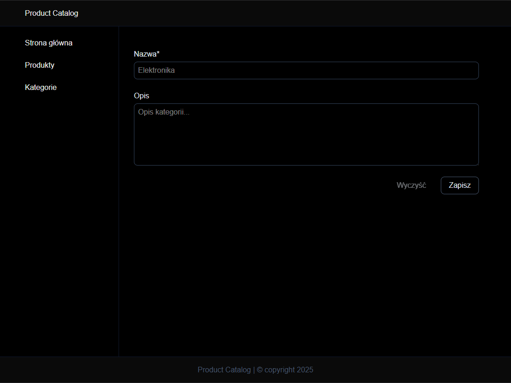
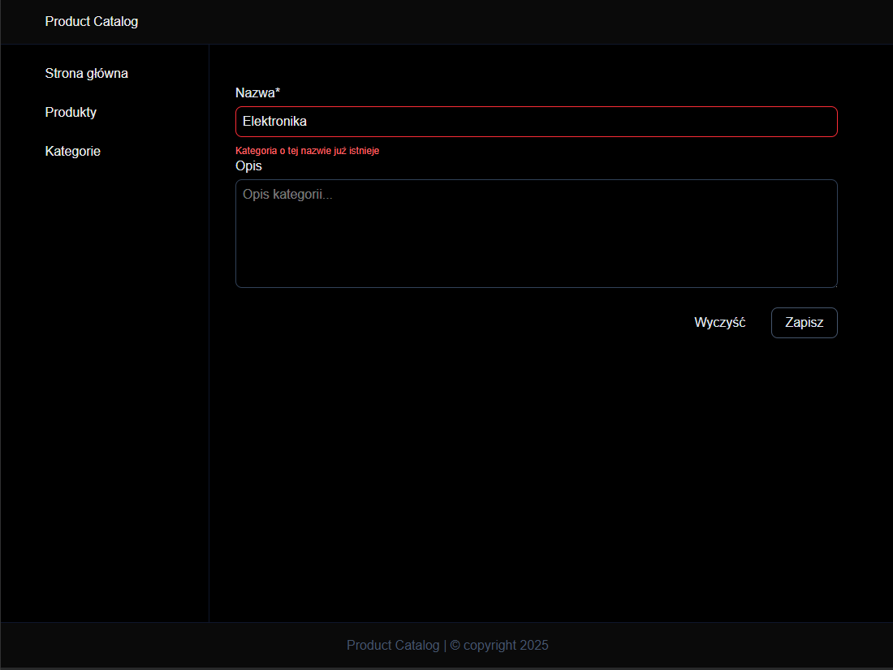
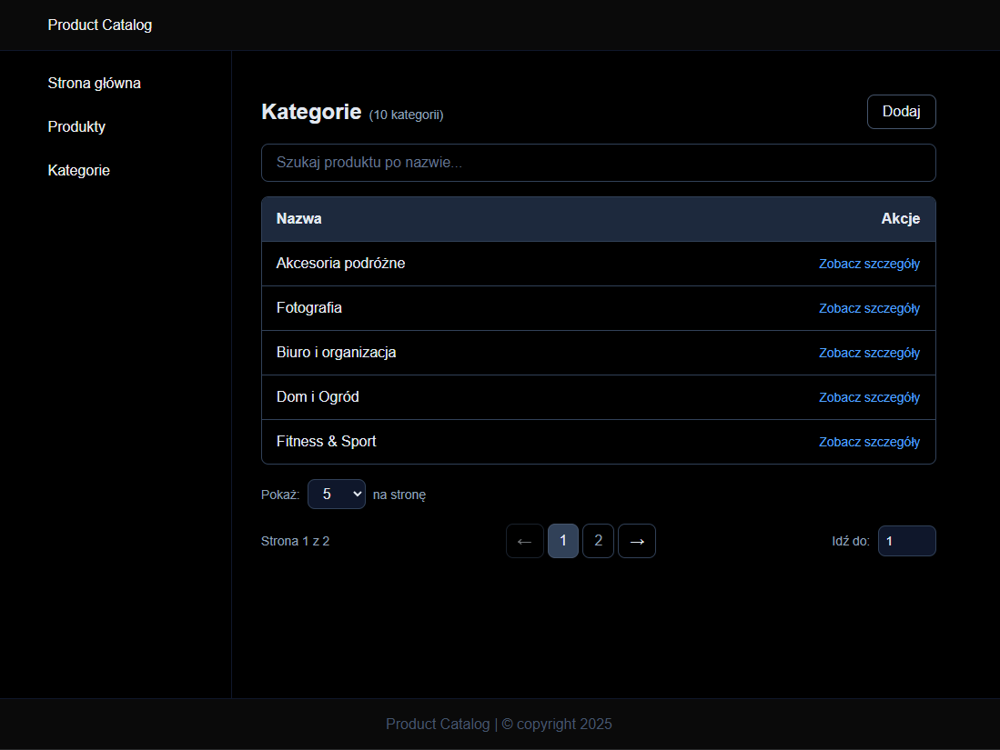
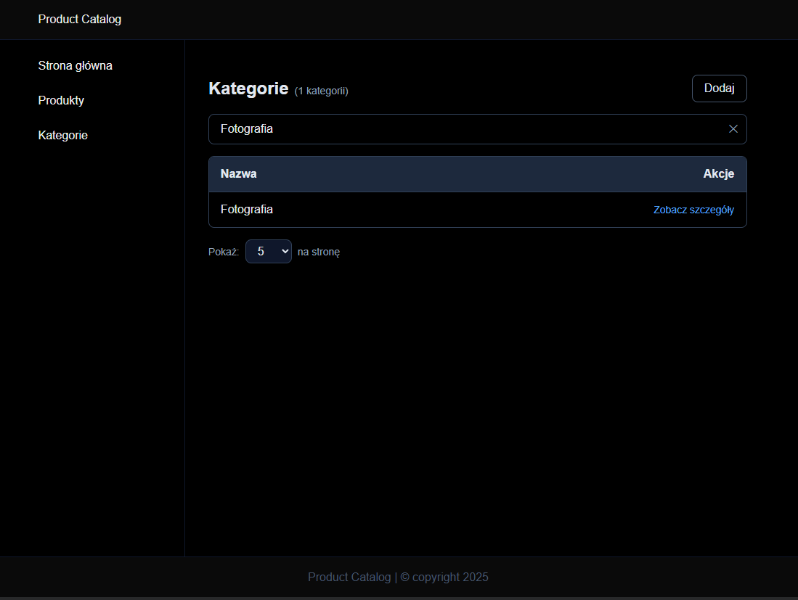
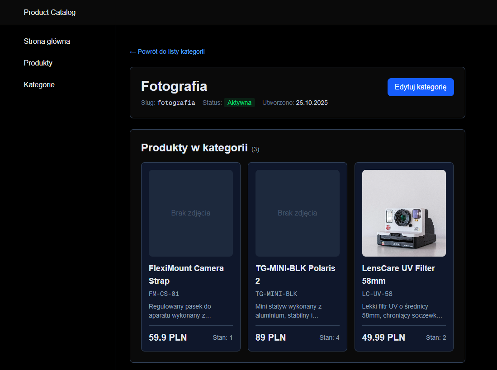
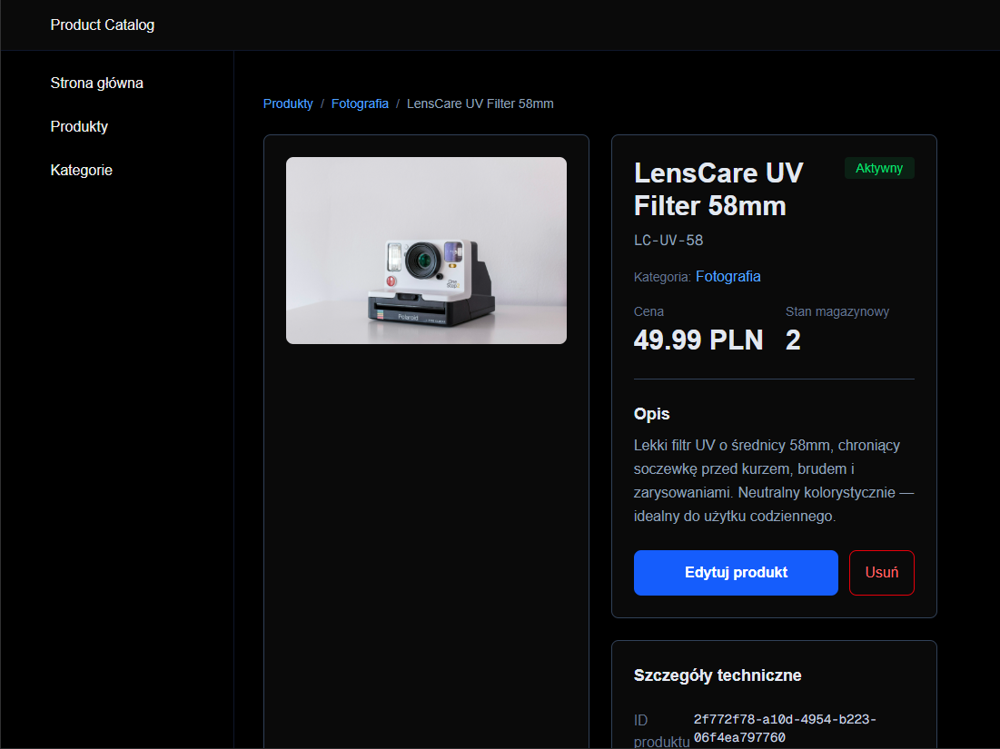
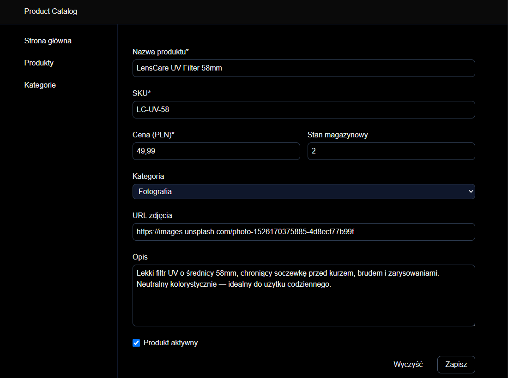
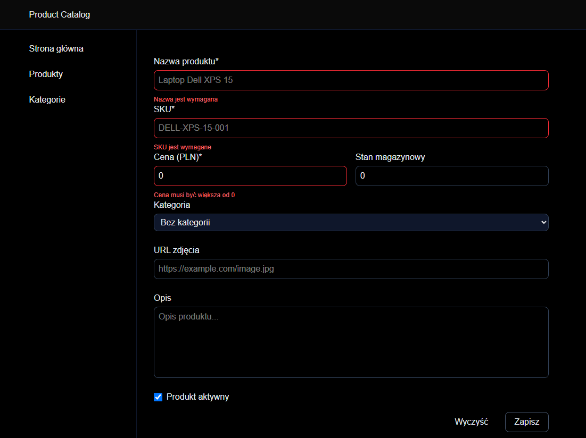

# Product Catalog

Full-stack product catalog application with advanced inventory management, built with modern technologies.

## 🛠️ Tech Stack

- **Frontend:** React 19, Next.js 16 (App Router), TypeScript
- **Backend:** Next.js API Routes
- **Database:** MySQL 8 with Prisma ORM
- **Validation:** Zod
- **Forms:** React Hook Form
- **Styling:** Tailwind CSS
- **Notifications:** React Hot Toast
- **Containerization:** Docker & Docker Compose

---
## 📸 Screenshots











## ✨ Features

### 📦 Products
- ✅ Create, view, and search products
- ✅ Product details with full information
- ✅ Unique SKU validation
- ✅ Stock and price management
- ✅ Image URL support
- ✅ Active/inactive status toggle

### 🏷️ Categories
- ✅ Create and manage categories
- ✅ Automatic slug generation
- ✅ View products by category
- ✅ Unique name validation

### 🔍 Search & Navigation
- ✅ Real-time product search with debounce
- ✅ Case-insensitive search
- ✅ Pagination with customizable page size (5/10/20/50)
- ✅ Quick jump to page
- ✅ Breadcrumb navigation

### 📋 Forms & Validation
- ✅ Client & server-side validation (Zod)
- ✅ Field-level error messages
- ✅ Backend error mapping to form fields
- ✅ Loading states and toast notifications
- ✅ Form reset functionality

### 🎨 UI/UX
- ✅ Responsive design (mobile-first)
- ✅ Dark theme with Tailwind CSS
- ✅ Empty states and loading indicators
- ✅ Table and grid views
- ✅ Smooth transitions and hover effects

## Installation

Use npm on Windows

```bash
npm install
```

Rename .env.example to .env

Run Docker Desktop for Windows

```bash
docker-compose up -d
```

Prisma setup

```bash
npx prisma generate
npx prisma db push
```

Start Application

```bash
npm run dev
```

## 🚀 Future Enhancements

- [ ] Product image upload with cloud storage
- [ ] Bulk operations (delete, update multiple)
- [ ] Export to CSV/Excel
- [ ] Advanced filtering (price range, stock level)
- [ ] Sorting options (by price, name, date)
- [ ] User authentication & roles
- [ ] Audit logs
- [ ] Product variants (size, color)
- [ ] Inventory alerts (low stock notifications)
- [ ] Sales analytics dashboard